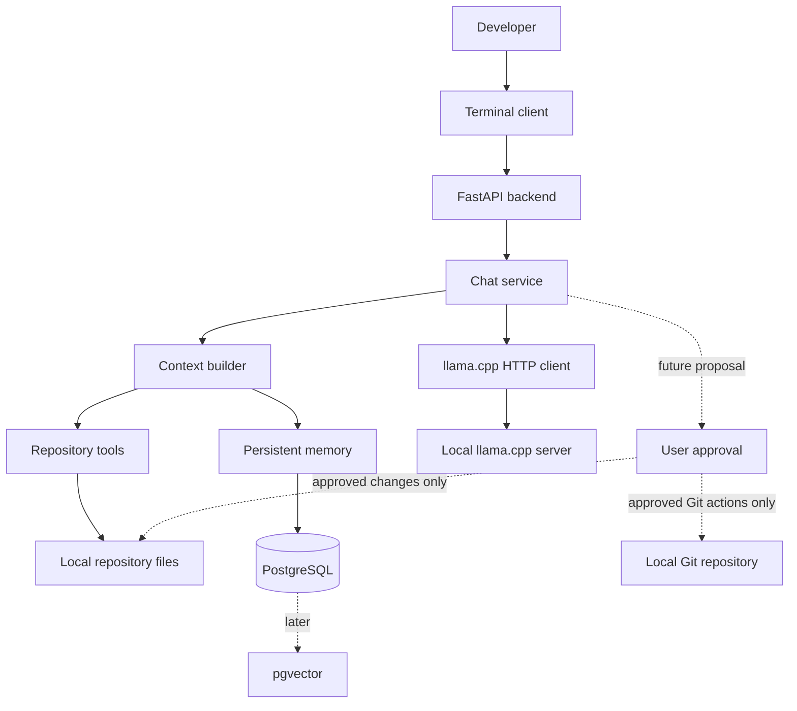

# Local Coding Agent Architecture

## 1. What we are building

This project will become a small, local-first coding assistant. A user will talk to it from a terminal. The Python backend will eventually ask a locally running `llama.cpp` server for answers, read approved repository files, and propose code changes.

The important word is **eventually**. We are deliberately building one thin, working slice at a time.

The first checkpoint proved that:

1. Python runs inside a virtual environment owned by this project.
2. The required Python packages can be imported.
3. A FastAPI application starts locally.
4. A health endpoint returns a valid response.

The second checkpoint now also proves that a small Qwen model runs through a local CUDA-enabled `llama.cpp` server, FastAPI streams its output, and the terminal client displays it. The system still does not inspect or edit repositories, use PostgreSQL, or run Git commands.

## Current working slice

The model process and Python process stay separate:

1. `llama-server.exe` loads `Qwen3.5-2B-Q5_K_M.gguf` and listens only on `127.0.0.1:8080`.
2. FastAPI listens only on `127.0.0.1:8000` and talks to llama.cpp over HTTP.
3. The terminal client sends conversation messages to FastAPI.
4. FastAPI returns newline-delimited JSON events. A token event carries text, a done event ends the response, and an error event explains a failure.

This extra HTTP hop may look unnecessary for a tiny demo, but it gives us one stable boundary. Future repository tools can live in Python without becoming part of the model runtime, and a future editor UI can reuse the same API.

The initial settings are deliberately conservative for the 4 GiB GTX 1650: one request at a time, an 8,192-token context, all possible model layers on the GPU, and an 8-bit KV cache. The model and 8K context fit with room left in GPU memory.

## 2. Why the system is split into components

Keeping responsibilities separate makes the code easier to understand and test. For example, the terminal client should not know how a model is loaded, and the model client should not know how repository files are searched.

These components live in one Python project. They are modules in a **modular monolith**, not separate microservices.



## 3. What each component does

### Terminal client

The terminal client is the user interface. It reads a prompt, sends it to the backend, and prints response tokens as they arrive.

It remains intentionally thin. A future editor extension can call the same backend without changing the agent.

### FastAPI backend

FastAPI is the local HTTP entry point. It validates requests with Pydantic, returns clear errors, and streams responses.

The backend will bind to `127.0.0.1` by default so it is not exposed to other computers on the network accidentally.

### Chat service

The chat service coordinates one user request. It receives validated messages, asks the context builder for relevant information, calls the inference client, and streams the answer back.

At first, this service will only pass conversation messages to the model. Tool use is a later milestone.

### llama.cpp HTTP client

`llama.cpp` runs as a separate local process. It owns model loading, CUDA/CPU inference, the GGUF model, and token generation.

Python communicates with its OpenAI-compatible HTTP API. Keeping this behind one small client module means model settings can change without changing the rest of the application.

The tested default is `Qwen3.5-2B-Q5_K_M.gguf`. Its Hugging Face repository, filename, revision, and local directory are configurable through environment variables, while the tested default keeps a pinned integrity check. The GPU-offload settings were accepted only after a real load and performance test on this computer.

### Context builder

A language model cannot receive an entire repository on every request. The context builder will select a small, relevant set of conversation messages and code excerpts.

The first repository-aware version will use file paths and text search. Embeddings and semantic retrieval come later, after simple retrieval has been evaluated.

### Repository tools

Repository tools will provide small operations such as:

- listing files;
- reading a bounded text file;
- searching source text;
- later, proposing a patch and running approved tests.

Every path will be resolved and checked against the selected repository root. Repository content and model-generated tool arguments are untrusted input.

### PostgreSQL and pgvector

PostgreSQL will store durable application data when persistence first provides value. Repository registration and file metadata are expected to be the first records.

Later, PostgreSQL will also store conversations, task state, proposed changes, and repository-specific memory. `pgvector` will be added only when local embeddings are introduced. We will not add a second vector database or Redis without a measured need.

### Approval boundary

Reading a selected repository can be automatic after its root has been validated. Actions that change state require approval.

For a future code edit, the agent will create a patch proposal and show its exact diff. The user approves that specific proposal before it is applied. Branch creation, staging, commits, and every other state-changing Git operation require their own explicit approval. Pushing, rebasing, resetting, or discarding work will never happen automatically.

## 4. Request flow after the chat slice exists

1. The developer enters a message in the terminal.
2. The terminal sends typed conversation messages to FastAPI.
3. FastAPI validates message sizes and generation limits.
4. The chat service assembles a bounded prompt.
5. The llama.cpp client sends the prompt to the local model server.
6. The model server generates tokens.
7. Tokens stream through FastAPI to the terminal.
8. The terminal prints each token immediately.

When repository support is added, steps 4 and 5 will include relevant read-only repository context. They will not include the whole repository.

## 5. Planned source layout

```text
local-coding-agent/
|-- architecture.md
|-- pyproject.toml
|-- .env.example
|-- src/
|   `-- local_agent/
|       |-- config.py
|       |-- cli.py
|       |-- api/
|       |   |-- app.py
|       |   |-- routes.py
|       |   `-- schemas.py
|       |-- inference/
|       |   `-- llama_cpp.py
|       `-- services/
|           `-- chat.py
|-- tests/
|   |-- unit/
|   `-- integration/
`-- benchmarks/
    `-- inference.py
```

Directories will be created only when their code is needed. Empty abstractions make a small project harder to learn.

## 6. Milestone boundaries

### Checkpoint 1: environment and backend health

- Create or reuse `.venv` in the project directory.
- Install a minimal FastAPI dependency set.
- Start the backend.
- Prove `GET /health` works.
- Add focused tests.

### Checkpoint 2: local model chat

- Verify the CUDA-enabled llama.cpp server.
- Load the approved small Qwen GGUF.
- Add a typed inference client.
- Stream a model response through FastAPI.
- Add a terminal chat loop and inference measurements.

### Later milestones

- Add safe repository listing, reading, and searching.
- Add PostgreSQL-backed repository metadata.
- Add code-aware indexing and pgvector only after basic retrieval works.
- Add patch proposals, explicit approval, and validation.
- Add read-only Git tools, then separately approved Git mutations.

## 7. Design rules

- Prefer plain Python and small functions.
- Keep the model server separate from Python.
- Validate all external and model-generated data.
- Keep filesystem access inside an approved repository root.
- Put timeouts and result limits around tools.
- Make read operations easy and state changes explicit.
- Test with fake model responses so normal tests stay deterministic and offline.
- Record measurements before claiming that an optimization is faster.
- Do not add infrastructure until a working feature needs it.
