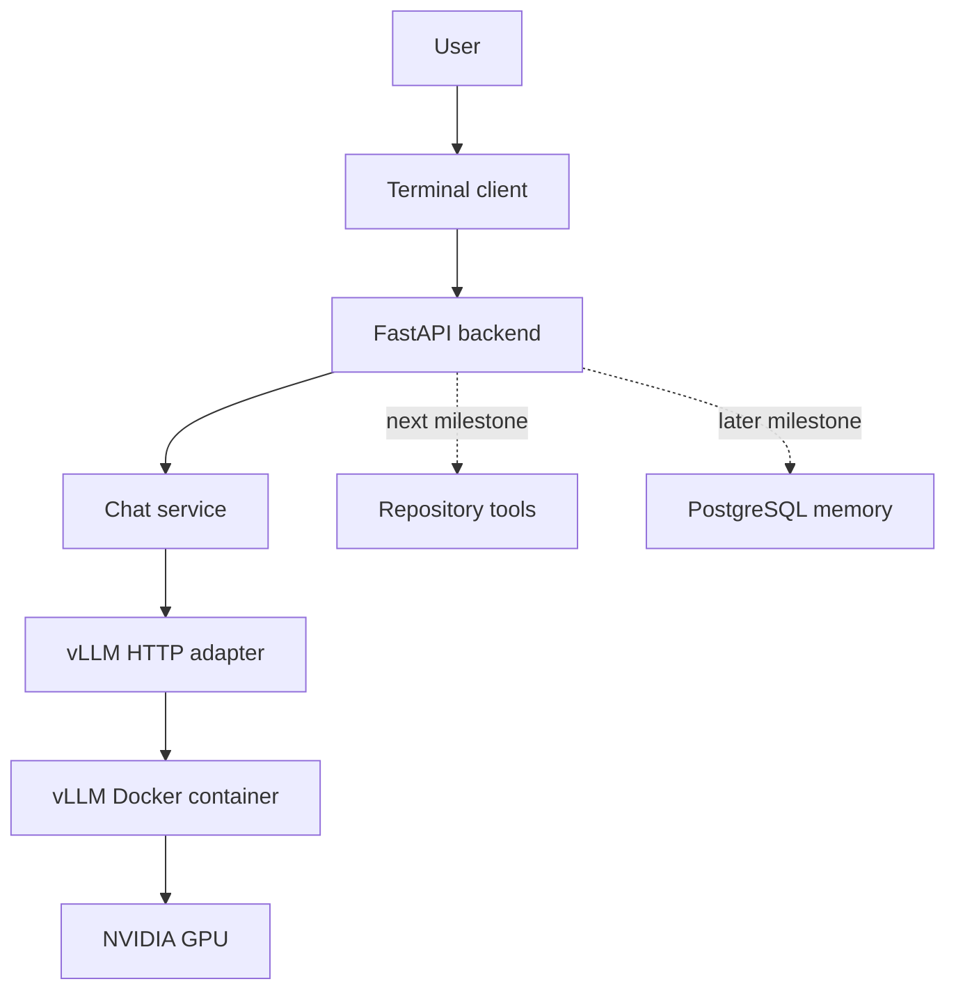

# RepoWren architecture

RepoWren is a modular monolith with one external inference service. The Python
application owns user interaction and orchestration; the Docker container owns
model loading and GPU execution.

## Current milestone

The current milestone provides a complete local chat path:

1. `repowren-chat` reads a prompt and keeps the active conversation in memory.
2. The client posts validated messages to `POST /v1/chat/stream`.
3. `ChatService` coordinates the request without depending on Docker details.
4. `VLLMClient` checks readiness and calls vLLM's OpenAI-compatible streaming
   endpoint.
5. Generated text deltas become small newline-delimited API events.
6. The terminal client prints each token as it arrives.

RepoWren and vLLM remain separate processes. The API does not install Torch,
load model weights, reserve GPU memory, or depend on Docker libraries. It only
needs the HTTP URL in `VLLM_BASE_URL`.

## Components

### `repowren/api`

`app.py` creates the FastAPI application and closes the inference HTTP client
during shutdown. `routes.py` exposes health, model status, and streamed chat.
`schemas.py` bounds message sizes, message counts, token counts, and temperature
before requests reach inference.

### `repowren/services`

`chat.py` converts inference output into `status`, `token`, `done`, and `error`
events. This keeps the public API independent of vLLM's Server-Sent Events.

### `repowren/inference`

`base.py` defines the narrow interface the chat service needs. `vllm.py` is the
only application module that understands vLLM's OpenAI-compatible protocol.
Network, readiness, and response-format failures become actionable
`InferenceError` messages.

### `repowren/cli.py`

The terminal client is a separate HTTP consumer. It does not import the agent
service or inference implementation, so a future editor interface can use the
same API without changing the backend.

### `compose.yaml`

Docker Compose runs only vLLM. It grants the container one NVIDIA GPU, maps host
port `8001` to vLLM port `8000`, and persists model and compilation caches in
named volumes. Docker Compose commands provide the complete lifecycle interface.

## Configuration

Process variables take precedence over the ignored `.env` file.

- `VLLM_IMAGE` selects the container image.
- `VLLM_MODEL_ID` selects the served Hugging Face model.
- `VLLM_BASE_URL` tells RepoWren where vLLM is reachable.
- `VLLM_PORT` selects the host-side Docker port.
- `VLLM_MAX_MODEL_LEN` bounds prompt-plus-output context in vLLM.
- `VLLM_GPU_MEMORY_UTILIZATION` limits the fraction of GPU memory reserved.
- `VLLM_DTYPE` selects the model data type.
- `HF_TOKEN` optionally authenticates gated model downloads.
- `REPOWREN_API_URL` tells the terminal client where the API is reachable.

## Why Docker is the only vLLM installation path

vLLM requires Linux and a tightly matched Torch/CUDA environment. The official
container packages those dependencies together. RepoWren therefore does not
maintain a second vLLM Python environment or shell scripts inside the user's
Ubuntu distribution.

Docker Desktop still uses a Linux virtualization backend for GPU-enabled
containers on Windows. That infrastructure is managed by Docker rather than by
RepoWren.

## Testing boundaries

Offline tests use fake inference backends and `httpx.MockTransport`. They test
validation, readiness states, event ordering, SSE parsing, and terminal output
without Docker, a GPU, or a model download.

Hardware validation is intentionally separate:

1. Start the Compose service.
2. Wait for vLLM `/health` and `/v1/models`.
3. Start `repowren-api`.
4. Check RepoWren `/status`.
5. Run `repowren-chat` and `benchmarks/inference.py`.

## Next milestone: repository-aware assistant

After this milestone is accepted, RepoWren can add repository registration,
workspace-boundary validation, file listing, safe file reading, and basic text
search. That work should introduce a small orchestration layer and PostgreSQL
repository metadata without adding embeddings or code editing yet.

Later milestones can add persistent code chunks and pgvector retrieval,
approval-controlled patches and tests, then approval-controlled Git operations.
The terminal client, FastAPI boundary, and inference interface can remain
unchanged as those capabilities grow.
