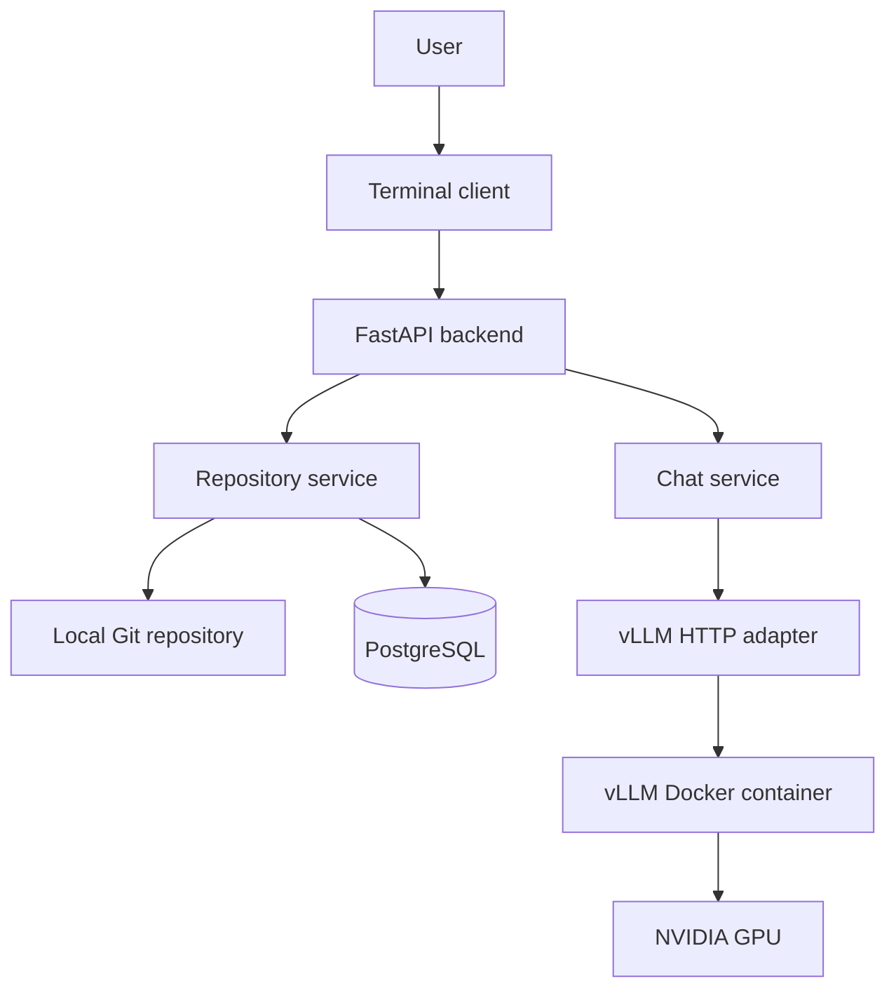

# RepoWren architecture

RepoWren is a modular monolith with two external Docker services. The Python
application owns user interaction, repository safety, and orchestration; vLLM
owns model loading and GPU execution, while PostgreSQL stores repository and
file metadata.

## Current milestone

The current milestone provides a repository-aware local chat path:

1. `repowren-chat` reads a prompt and keeps the active conversation in memory.
2. Repository commands register, select, list, read, and search local Git roots.
3. The repository service validates all paths and builds bounded source excerpts.
4. Repository-aware chat prepends those excerpts to validated messages.
5. `ChatService` coordinates the request without depending on Docker details.
6. `VLLMClient` checks readiness and calls vLLM's OpenAI-compatible streaming
   endpoint.
7. Generated text deltas become small newline-delimited API events.
8. The terminal client prints each token as it arrives.

RepoWren and vLLM remain separate processes. The API does not install Torch,
load model weights, reserve GPU memory, or depend on Docker libraries. It only
needs the HTTP URL in `VLLM_BASE_URL`.

## Components

### `repowren/api`

`app.py` creates the FastAPI application, applies database migrations at
startup, and closes owned resources during shutdown. `routes.py` exposes
health, model status, repository tools, and streamed chat. `schemas.py` bounds
messages, paths, searches, result counts, token counts, and temperature.

### `repowren/repositories`

`service.py` owns the repository security boundary. It canonicalizes Git roots,
rejects traversal and symlink escape, respects root `.gitignore`, skips secrets,
binary/generated/model files, and bounds file sizes and result counts. Context
construction uses simple request keywords and line-numbered excerpts; it does
not use embeddings in this phase.

### `repowren/persistence`

`postgres.py` persists repositories, the active selection, and file hashes and
metadata through a narrow store interface. Packaged SQL migrations run once and
are recorded in `schema_migrations`.

### `repowren/services`

`chat.py` converts inference output into `status`, `token`, `done`, and `error`
events. This keeps the public API independent of vLLM's Server-Sent Events.

### `repowren/inference`

`base.py` defines the narrow interface the chat service needs. `vllm.py` is the
only application module that understands vLLM's OpenAI-compatible protocol.
Network, readiness, and response-format failures become actionable
`InferenceError` messages.

### `repowren/cli.py`

The terminal client is a separate HTTP consumer. It does not import the agent
service or inference implementation, so a future editor interface can use the
same API without changing the backend.

### `compose.yaml`

Docker Compose runs vLLM and PostgreSQL. It grants vLLM one NVIDIA GPU, maps host
port `8001` to vLLM port `8000`, and persists model, compilation, and database
data in named volumes. Docker Compose commands provide the lifecycle interface.
`Dockerfile.vllm` derives from the pinned official CUDA 12.9 image and removes
the optional TorchCodec multimedia decoder. RepoWren serves text, and the
current TorchCodec binary is linked against CUDA 13, so retaining it prevents
vLLM from importing on the CUDA 12.9 image.

## Configuration

Process variables take precedence over the ignored `.env` file.

- `VLLM_IMAGE` selects the container image.
- `VLLM_MODEL_ID` selects the served Hugging Face model.
- `VLLM_BASE_URL` tells RepoWren where vLLM is reachable.
- `VLLM_PORT` selects the host-side Docker port.
- `VLLM_MAX_MODEL_LEN` bounds prompt-plus-output context in vLLM.
- `VLLM_GPU_MEMORY_UTILIZATION` limits the fraction of GPU memory reserved.
- `VLLM_DTYPE` selects the model data type.
- `HF_TOKEN` optionally authenticates gated model downloads.
- `REPOWREN_API_URL` tells the terminal client where the API is reachable.
- `DATABASE_URL` tells the API where PostgreSQL is reachable.
- `POSTGRES_USER`, `POSTGRES_PASSWORD`, `POSTGRES_DB`, and `POSTGRES_PORT`
  configure the Compose database service.

## Why Docker is the only vLLM installation path

vLLM requires Linux and a tightly matched Torch/CUDA environment. The official
container packages those dependencies together. RepoWren therefore does not
maintain a second vLLM Python environment or shell scripts inside the user's
Ubuntu distribution.

Docker Desktop still uses a Linux virtualization backend for GPU-enabled
containers on Windows. That infrastructure is managed by Docker rather than by
RepoWren.

## Testing boundaries

Offline tests use fake inference backends, an in-memory repository store, and
`httpx.MockTransport`. They test repository boundaries, ignored files, context
construction, validation, event ordering, and terminal output without Docker,
a GPU, a database, or a model download.

Hardware validation is intentionally separate:

1. Start the Compose service.
2. Wait for vLLM `/health` and `/v1/models`.
3. Start `repowren-api`.
4. Check RepoWren `/status`.
5. Run `repowren-chat` and `benchmarks/inference.py`.

## Safety boundary and next milestone

Phase 2 is read-only. Repository tools cannot modify source, execute commands,
or perform Git operations. The database contains metadata, not copied source
contents. Later milestones can add persistent code chunks and pgvector
retrieval, approval-controlled patches and tests, then approval-controlled Git
operations. The terminal client, FastAPI boundary, and inference interface can
remain unchanged as those capabilities grow.
